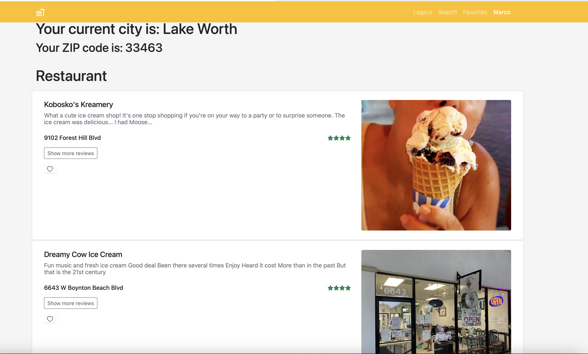

# SaviorAI
This project is a web application that uses HTML, CSS, and Bootstrap for the frontend, Node.js for the backend, and Yelp API for retrieving restaurant data. The application allows users to search for restaurants based on food name and location and get recommendations for the best restaurant based on Yelp reviews using a chatbot powered by OpenAI's GPT-3 language model.

Installation
Before running the project, ensure that Node.js and npm are installed on your system. You can download and install Node.js from here and npm will be installed along with Node.js.

To install the required packages, run the following command in the project directory:

npm install

Usage
To start the server, run the following command:

npm start

Yelp Reviews Recommendation Chatbot
This project is a web application that uses HTML, CSS, and Bootstrap for the frontend, Node.js for the backend, and Yelp API for retrieving restaurant data. The application allows users to search for restaurants based on food name and location and get recommendations for the best restaurant based on Yelp reviews using a chatbot powered by OpenAI's GPT-3 language model.

Installation
Before running the project, ensure that Node.js and npm are installed on your system. You can download and install Node.js from here and npm will be installed along with Node.js.

To install the required packages, run the following command in the project directory:

npm install

To start the server, run the following command:

node server.js

This will start the server on port 8080.

Open your web browser and go to http://localhost:8080 to use the application.

Enter the food name and location in the search bar and click the "Search" button. The application will retrieve restaurant data from Yelp and display it on the screen. Then, the chatbot will ask recommend the best restaurant based on Yelp reviews.

